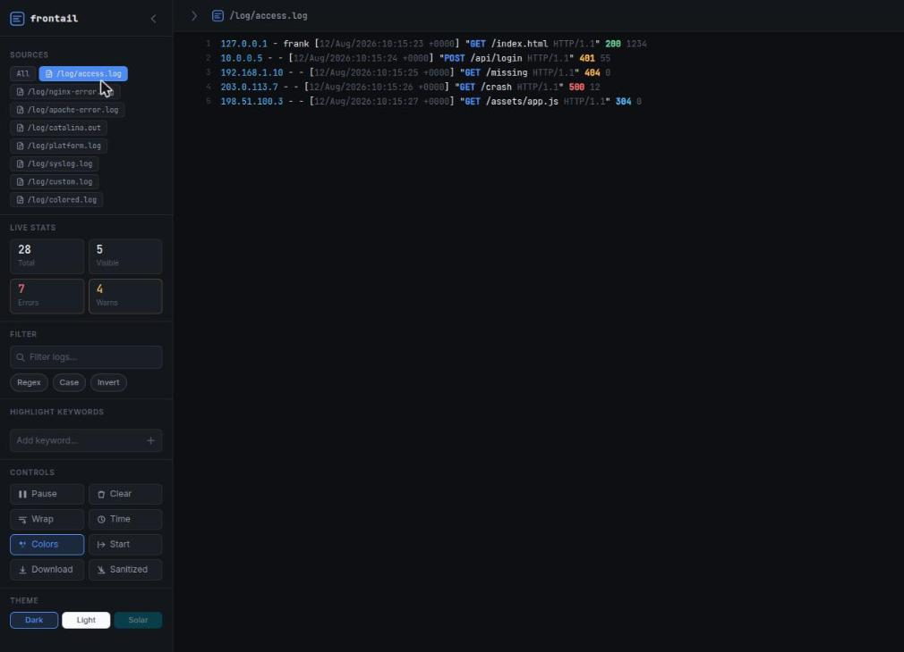
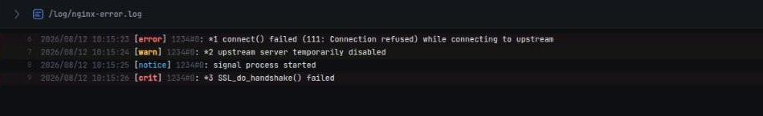
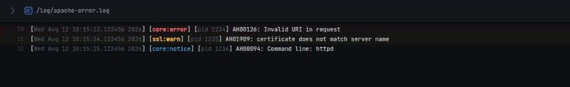
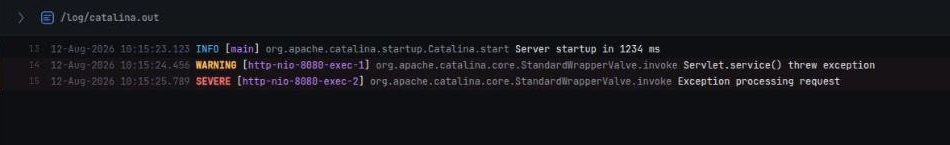
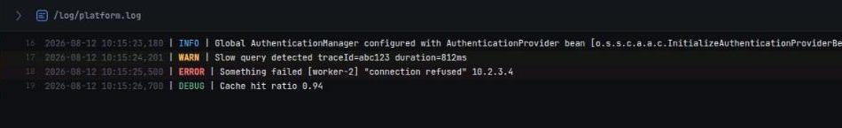
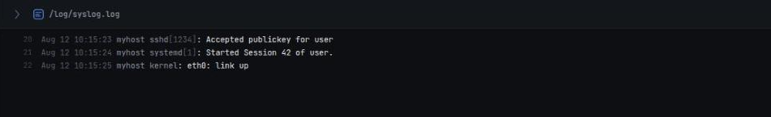
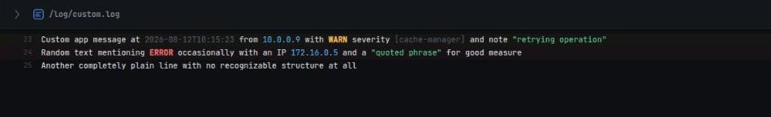
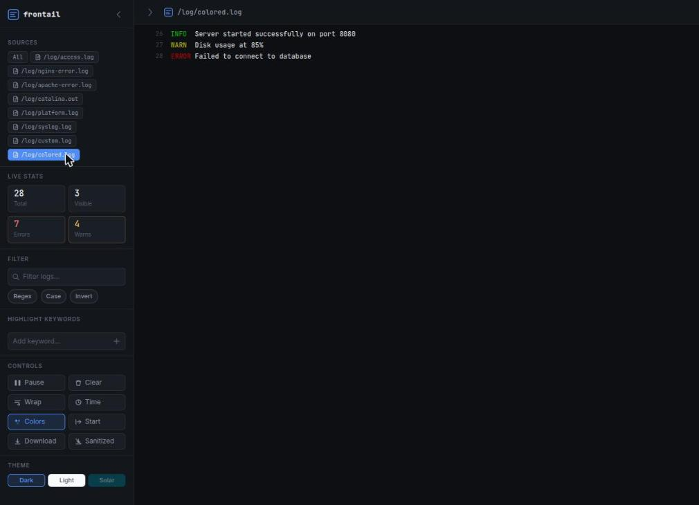

# frontail — streaming logs to the browser

[](https://github.com/sponsors/hbenali)
[](https://frontail.hbenali.ovh/)

> **This repository is a fork of [mthenw/frontail](https://github.com/mthenw/frontail) by [@hbenali](https://github.com/hbenali), extended with a modernised UI, richer features, and an updated Docker base image.**

`frontail` is a Node.js application that streams log files to the browser — `tail -F` with a UI. Point it at any file (or stdin) and watch lines appear in real time.

**[👉 Try the live demo](https://frontail.hbenali.ovh/)** — fake logs streaming continuously across every format frontail auto-colorizes (apache2/nginx, Tomcat, Log4j/Logback, syslog, ANSI-colored sources).

---

## Quick start

```bash
npm i frontail -g
frontail /var/log/syslog
# open http://127.0.0.1:9001
```

Or with Docker:

```bash
docker run -d -p 9001:9001 -v /var/log:/log hbenali/frontail /log/syslog
```

---

## What's new in this fork

| Area | Change |
|---|---|
| **UI** | Full sidebar/main two-pane layout, JetBrains Mono log font |
| **Containers** | Stream logs from Docker or Podman containers alongside files |
| **Source selector** | Sidebar pills to filter by source — click a container or file to isolate its logs |
| **Themes** | Dark, Light, Solarized — switched at runtime with correct per-theme button colours |
| **Persistence** | Theme, word wrap, timestamps, filter, sidebar state, and source selection saved in `localStorage` |
| **Filter** | Regex mode, case-sensitive toggle, invert-filter, inline match highlighting |
| **Highlight** | Up to 5 colour-coded keyword highlighters, applied to all existing and new lines |
| **Stats** | Live counters for total / visible / error / warn lines |
| **Line numbers** | Gutter line numbers on every entry |
| **Timestamps** | Per-line `HH:MM:SS.ms` toggle |
| **Mobile** | Full-screen sidebar sheet, no horizontal scroll, word-wrap forced, safe-area aware |
| **Keyboard** | `Ctrl/Cmd+K` focus filter · `Space` pause · `Shift+G` jump to bottom · `Esc` clear |
| **Docker** | Multi-stage build, Node 24 LTS on Debian Bookworm Slim, non-root user |

---

## Features

- Real-time log streaming over WebSocket
- **Docker/Podman container log streaming** — `--container` flag, any engine
- **Source selector** — sidebar pills to filter logs by source (files or containers)
- **Container log download** — download full container history via browser
- Log rotation support (Linux/macOS)
- Auto-scroll with scroll-to-bottom FAB (shows `+N` new lines count)
- Pause / resume stream with skip counter
- Unread-line count in browser favicon
- Three built-in themes (Dark · Light · Solarized) — all settings persisted across sessions
- Advanced filter: plain text, regex, case-sensitive, invert
- Keyword highlight (up to 5 coloured keywords)
- ANSI colour code rendering
- **Automatic log colorizing** — autodetects apache2/nginx access & error logs, Tomcat/Catalina, Log4j/Logback, and generic syslog, colouring timestamps, IPs, HTTP methods/status codes, log levels, etc.; falls back to generic token coloring (timestamps/levels/IPs/brackets/quotes) for anything else. Enabled by default (`--ui-no-colors` to disable); skipped on lines that already carry ANSI colour codes. Extensible with your own rules via `--ui-colors-preset`
- **JSON log line colorizing** — structured JSON-lines logs (pino, winston-json, bunyan, Go structured logging, …) are rendered as colorized `key=value` pairs instead of raw escaped JSON
- **ANSI-source indicator** — badge shown when the current source already streams ANSI-coloured lines (per-source: `ANSI colors` / `Mixed colors` depending on what's selected)
- **Sanitized download** — when ANSI colours are detected, an extra "Sanitized" download strips the colour codes before saving
- **Level quick-filter chips** — toggle Error / Warn / Info / Debug on or off with one click; combines with the text filter
- **Saved filter presets** — save the current filter (text + regex/case/invert) under a name, then reapply or delete it later
- **Download the currently visible lines** — export exactly what's on screen (after filters, level chips, and source selection) as a `.txt` file, entirely client-side
- **Richer topbar title** — shows a file/container icon, the basename (full path on hover), a source count when viewing "All", and a small dot whenever a filter is narrowing what you see
- Click any line to select / deselect
- Word wrap toggle
- Per-line timestamps toggle
- Live stats: total / visible / errors / warnings
- Tailing multiple files and stdin
- Basic authentication (`-U` / `-P`)
- HTTPS (`-k` / `-c`)
- Running behind a path prefix (`--url-path`, `--path`)
- Customisable log highlighting presets

---

## Installation

```bash
# npm (global)
npm i frontail -g

# Docker
docker run -d -p 9001:9001 -v /var/log:/log hbenali/frontail /log/syslog
```

---

## Usage

```
frontail [options] [file ...]

Options:
  -V, --version                 output the version number
  -h, --host <host>             listening host (default: 0.0.0.0)
  -p, --port <port>             listening port (default: 9001)
  -n, --number <number>         starting lines number (default: 10)
  -l, --lines <lines>           lines stored in browser (default: 2000)
  -t, --theme <theme>           name of the theme (default, dark)
  -d, --daemonize               run as daemon
  -U, --user <username>         Basic Auth username (requires -P)
  -P, --password <password>     Basic Auth password (requires -U)
  -k, --key <key.pem>           Private key for HTTPS (requires -c)
  -c, --certificate <cert.pem>  Certificate for HTTPS (requires -k)
  -C, --container <container>   container name or id
  --container-engine <engine>   container engine (docker, podman) (default: docker)
  --pid-path <path>             daemon PID file (default: /var/run/frontail.pid)
  --log-path <path>             daemon log file (default: /dev/null)
  --url-path <path>             URL path for browser app (default: /)
  --ui-hide-topbar              hide topbar
  --ui-no-indent                don't indent log lines
  --ui-highlight                enable word/line highlighting
  --ui-highlight-preset <path>  custom highlight preset JSON
  --ui-no-colors                disable log colorizing (ANSI + format autodetection), on by default
  --ui-colors-preset <path>     extra log colorizing rules JSON (see ./preset/colors-example.json)
  --path <path>                 prefix path (default: /)
  --disable-usage-stats         disable anonymous usage statistics
  --help                        output usage information
```

Web interface: **http://[host]:[port]**

---

## Keyboard shortcuts

| Key | Action |
|---|---|
| `Ctrl/Cmd + K` | Focus filter input |
| `Space` | Pause / resume stream |
| `Shift + G` | Scroll to bottom |
| `Esc` | Clear filter |

---

## Filtering

Beyond the text filter (plain / regex / case-sensitive / invert), the sidebar has:

- **Level chips** (Error / Warn / Info / Debug) — click to hide/show lines of that severity, detected the same way the error/warn stat counters are. Combines with the text filter (AND). Lines with no detectable level (most access logs, for instance) are never hidden by these chips.
- **Saved filters** — type a filter, give it a name in the "Saved Filters" box, and it's remembered (with its regex/case/invert flags) for one-click reapplying later. Click the name to apply, the × to delete.
- **Filtered download** (sidebar Controls → **Filtered**) — downloads exactly the lines currently on screen, after the text filter, level chips, and source selection are all applied, as a `.txt` file. This happens entirely in the browser (no server round-trip), so it reflects what you're looking at, not the original file.

A small dot next to the topbar title appears whenever a filter (text or level) is currently narrowing what you see.

---

## Mobile

On small screens the sidebar becomes a full-screen overlay panel. Tap the **☰** icon in the top-left to open it, and use the **←** button inside to close it and return to the log view. Logs wrap to the window width with no horizontal scroll.

---

## Tailing multiple files

`[file ...]` accepts multiple paths and shell glob patterns. Each file becomes a separate **source pill** in the sidebar:

```bash
frontail /var/log/nginx/access.log /var/log/nginx/error.log
frontail /var/log/*.log
```

## Mixing files and containers

Files and containers can be tailed simultaneously — each appears as its own pill:

```bash
frontail /var/log/syslog --container nginx -C postgres
```

## stdin

Use `-` to stream stdin:

```bash
./server | frontail -
```

## Docker/Podman container logs

Stream logs from one or more containers:

```bash
frontail --container my-container
frontail -C c1 -C c2
```

Specify container engine (default is `docker`):

```bash
frontail --container my-container --container-engine podman
```

### Downloading container logs

Click a container source pill in the sidebar, then press **Download** to get the full log history as a `.log` file.

### Docker setup for container streaming

To stream container logs from within the frontail Docker image, mount the Docker socket:

```yaml
# docker-compose.yml
frontail:
  image: hbenali/frontail:2.8
  command: --container myapp /logs/syslog
  volumes:
    - /var/log:/logs:ro
    - /var/run/docker.sock:/var/run/docker.sock:ro
```

The entrypoint automatically adds the `frontail` user to the socket's group at startup.

---

## Highlighting presets

`--ui-highlight` enables log highlighting. The default preset is `./preset/default.json`:

```json
{
  "words": {
    "err": "color: red;"
  },
  "lines": {
    "err": "font-weight: bold;"
  }
}
```

Available presets: `default`, `npmlog`, `python`.

---

## Log colorizing



Enabled by default — pass `--ui-no-colors` to turn it off server-wide. Each viewer can also flip the **Colors** button in the sidebar; that per-browser choice is saved and overrides the server default.

Two things happen per line, depending on whether it already carries ANSI escape codes:

- **Line already has ANSI codes** (e.g. an app logging with `chalk`/`colorlog`): they're rendered as-is, and format autodetection is skipped for that line so colours don't clash. A small badge appears in the topbar, and a **Sanitized** download button appears in the sidebar controls — both scoped to whichever source(s) are currently selected: **ANSI colors** when the selected source (or, with multiple sources selected, *all* of them) has ANSI codes, **Mixed colors** when only some of the selected sources do, and hidden entirely otherwise.
- **Plain-text line**: frontail tries to recognise the log format and colours the relevant fields — timestamps, IPs, HTTP methods/paths, status codes (2xx green, 3xx cyan, 4xx amber, 5xx red), thread/pid, and log level. Recognised formats:
  - JSON-lines (any line that parses as a single JSON object — pino, winston-json, bunyan, structured logging, …) — rendered as colorized `key=value` pairs, with `level`/`time`/`status`/`ip`-ish keys auto-classed
  - Apache2 / Nginx combined & common access logs
  - Apache2 error log (classic and `[core:error]`/`[pid N]` styles)
  - Nginx error log
  - Tomcat/Catalina (`juli` one-line format and the classic two-line format)
  - Log4j/Logback pipe-delimited (`2024-01-01 12:00:00,000 | INFO | message [logger<thread>]`)
  - Generic syslog

  If none of those match, a **generic fallback** still colours whatever it recognises anywhere in the line: timestamps, log-level words, IPv4 addresses, `[bracketed]` metadata, and `"quoted strings"`. So even a completely custom log format gets *some* coloring by default.

Turning colors off also falls back to plain text for ANSI-coloured sources (no `ansi_to_html`), useful when a source's colours are noisy or clash with your theme.

### Screenshots by format

Each rule colours only the fields it recognises — timestamps, levels, status codes, etc. — leaving the rest of the message untouched, the same way a real `catalina.out` viewer would:

| Format | Example |
|---|---|
| Nginx error log |  |
| Apache2 error log |  |
| Tomcat/Catalina (`catalina.out`) |  |
| Log4j/Logback pipe-delimited |  |
| Generic syslog |  |
| Anything else (generic fallback) |  |

### Sanitized download

If a source contains ANSI codes, the sidebar shows a **Sanitized** download button alongside the normal **Download** button, and a badge marks the source as already colorized. It streams the same file/container log through `/download?...&sanitize=1`, which strips ANSI escape sequences line-by-line server-side before sending it — handy for pasting logs elsewhere without stray escape codes.



### Customizing: your own format rules

For a log format you want colored *precisely* (beyond what the generic fallback gives you), pass `--ui-colors-preset <path>` pointing at a JSON file of rules — see [`preset/colors-example.json`](./preset/colors-example.json). Rules are checked before the built-in formats, so they can also override them.

Each rule is:

```json
{
  "name": "log4j-pipe",
  "regex": "^(\\d{4}-\\d{2}-\\d{2} \\d{2}:\\d{2}:\\d{2}[.,]\\d{3})\\s*\\|\\s*(\\w+)\\s*\\|\\s*",
  "template": "{1:time} | {2:level} | "
}
```

- **`regex`** — a JS regex source (as a JSON string, so backslashes need escaping). Anchor with `^` to match a structured prefix (like the built-ins), or leave unanchored to colorize a field anywhere in the line (e.g. `"traceId=(\\S+)"`).
- **`flags`** — optional regex flags, e.g. `"i"`. Avoid `"g"` — matching is always single-shot per line.
- **`template`** — the replacement for whatever the regex matched. Reference capture groups with `{N}`; add `:spec` to color them:
  - `{1:time}`, `{1:ip}`, `{1:method}`, `{1:logger}`, … → any name maps to a `log-fc-<name>` CSS class (style your own in a custom stylesheet, or reuse a built-in one like `time`/`ip`/`meta`/`str`)
  - `{1:status}` → auto-colored red/amber/cyan/green by first digit (2xx/3xx/4xx/5xx), for HTTP-style status codes
  - `{1:level}` → auto-colored by severity (error/warn/info/debug), for log-level words
  - `{1:#c084fc}` (or `rgb(...)`, `hsl(...)`) → an inline color, no CSS needed
  - `{1}` with no spec → inserted as plain text, unstyled

Only the text the regex matched gets replaced; the rest of the line (and any other rules/generic fallback) is unaffected. Rules are sent to the browser once per connection over the same socket channel as `--ui-highlight-preset`, so there's no need to edit `app.css`.

---

## Running behind nginx

```nginx
events { worker_connections 1024; }

http {
  server {
    listen 8080;

    location /frontail {
      proxy_pass http://127.0.0.1:9001/frontail;
      proxy_http_version 1.1;
      proxy_set_header Upgrade    $http_upgrade;
      proxy_set_header Connection "upgrade";
    }
  }
}
```

Start frontail with `--url-path /frontail`.

---

## Docker

```bash
# Build
docker build -t hbenali/frontail .

# Multi-arch build & push (FRONTAIL_VERSION/FRONTAIL_REVISION populate the
# image's org.opencontainers.image.* labels — see `docker inspect`)
docker buildx build --platform linux/amd64,linux/arm64 \
  --build-arg FRONTAIL_VERSION=$(node -p "require('./package.json').version") \
  --build-arg FRONTAIL_REVISION=$(git rev-parse HEAD) \
  -t hbenali/frontail:2.8 -t hbenali/frontail:latest --push .

# Run (file only)
docker run -d \
  -p 9001:9001 \
  -v /var/log:/log \
  hbenali/frontail /log/syslog

# Run (file + container streaming)
docker run -d \
  -p 9001:9001 \
  -v /var/log:/log:ro \
  -v /var/run/docker.sock:/var/run/docker.sock:ro \
  hbenali/frontail /log/syslog --container myapp

# Run with a custom log-colorizing preset (bind-mount it in, then point at it)
docker run -d \
  -p 9001:9001 \
  -v /var/log:/log:ro \
  -v ./my-colors.json:/frontail/preset/my-colors.json:ro \
  hbenali/frontail /log/syslog --ui-colors-preset /frontail/preset/my-colors.json
```

The image uses a **multi-stage build** (Node 24 LTS on Debian Bookworm Slim), includes `docker-ce-cli` for container streaming, and runs as a non-root `frontail` user. The entrypoint script adds the user to the docker group at runtime when `docker.sock` is mounted.

---

## Credits

- Original project: **[mthenw/frontail](https://github.com/mthenw/frontail)** by Maciej Winnicki
- This fork maintained by **[@hbenali](https://github.com/hbenali)**

If this fork is useful to you, consider [sponsoring @hbenali on GitHub](https://github.com/sponsors/hbenali).

## License

MIT
