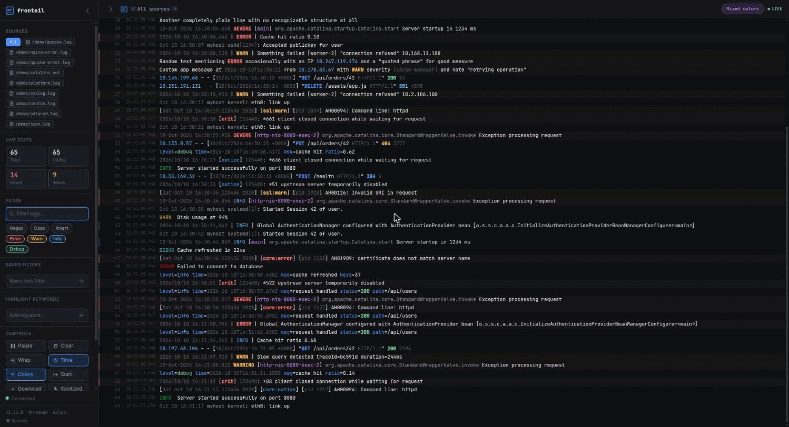

# frontail — streaming logs to the browser

[](https://github.com/hbenali/frontail/actions/workflows/push.yml)
[](https://github.com/sponsors/hbenali)
[](https://github.com/hbenali/frontail/actions/workflows/codeql.yml)
[](https://github.com/hbenali/frontail/actions/workflows/trivy.yml)
[](https://scorecard.dev/viewer/?uri=github.com/hbenali/frontail)
[](https://frontail.hbenali.ovh/)

> **This repository is a fork of [mthenw/frontail](https://github.com/mthenw/frontail) by [@hbenali](https://github.com/hbenali), extended with a modernised UI, richer features, and an updated Docker base image.**

`frontail` is a Node.js application that streams log files to the browser — `tail -F` with a UI. Point it at any file (or stdin) and watch lines appear in real time.

**[👉 Try the live demo](https://frontail.hbenali.ovh/)** — fake logs streaming continuously across every format frontail auto-colorizes (apache2/nginx, Tomcat, Log4j/Logback, syslog, JSON lines, ANSI-colored sources).



---

## Quick start

```bash
npm i -g @hbenali/frontail
frontail /var/log/syslog
# open http://127.0.0.1:9001
```

Or with Docker:

```bash
docker run -d -p 9001:9001 -v /var/log:/log hbenali/frontail /log/syslog
```

---

## What's new in this fork

| Area | Change |
|---|---|
| **UI** | Full sidebar/main two-pane layout, JetBrains Mono log font |
| **Containers** | Stream logs from Docker or Podman containers alongside files |
| **Source selector** | Sidebar pills to filter by source — click a container or file to isolate its logs |
| **Themes** | Dark, Light, Solarized — switched at runtime with correct per-theme button colours |
| **Persistence** | Theme, word wrap, timestamps, filter, sidebar state, and source selection saved in `localStorage` |
| **Filter** | Regex mode, case-sensitive toggle, invert-filter, inline match highlighting |
| **Highlight** | Up to 5 colour-coded keyword highlighters, applied to all existing and new lines |
| **Stats** | Live counters for total / visible / error / warn lines |
| **Line numbers** | Gutter line numbers on every entry |
| **Timestamps** | Per-line `HH:MM:SS.ms` toggle |
| **Mobile** | Full-screen sidebar sheet, no horizontal scroll, word-wrap forced, safe-area aware |
| **Keyboard** | `Ctrl/Cmd+K` focus filter · `Space` pause · `Shift+G` jump to bottom · `Esc` clear |
| **Docker** | Multi-stage build, Node 24 LTS on Alpine, non-root user, hardened against known CVEs |

---

## Features

- Real-time log streaming over WebSocket
- **Docker/Podman container log streaming** — `--container` flag, any engine
- **Source selector** — sidebar pills to filter logs by source (files or containers)
- **Container log download** — download full container history via browser
- Log rotation support (Linux/macOS)
- Auto-scroll with scroll-to-bottom FAB (shows `+N` new lines count)
- Pause / resume stream with skip counter
- Unread-line count in browser favicon
- Three built-in themes (Dark · Light · Solarized) — all settings persisted across sessions
- Advanced filter: plain text, regex, case-sensitive, invert
- Keyword highlight (up to 5 coloured keywords)
- ANSI colour code rendering
- **Automatic log colorizing** — autodetects apache2/nginx access & error logs, Tomcat/Catalina, Log4j/Logback, and generic syslog, colouring timestamps, IPs, HTTP methods/status codes, log levels, etc.; falls back to generic token coloring (timestamps/levels/IPs/brackets/quotes) for anything else. Enabled by default (`--ui-no-colors` to disable); skipped on lines that already carry ANSI colour codes. Extensible with your own rules via `--ui-colors-preset`
- **JSON log line colorizing** — structured JSON-lines logs (pino, winston-json, bunyan, Go structured logging, …) are rendered as colorized `key=value` pairs instead of raw escaped JSON
- **ANSI-source indicator** — badge shown when the current source already streams ANSI-coloured lines (per-source: `ANSI colors` / `Mixed colors` depending on what's selected)
- **Sanitized download** — when ANSI colours are detected, an extra "Sanitized" download strips the colour codes before saving
- **Level quick-filter chips** — toggle Error / Warn / Info / Debug on or off with one click; combines with the text filter
- **Saved filter presets** — save the current filter (text + regex/case/invert) under a name, then reapply or delete it later
- **Download the currently visible lines** — export exactly what's on screen (after filters, level chips, and source selection) as a `.txt` file, entirely client-side
- **Richer topbar title** — shows a file/container icon, the basename (full path on hover), a source count when viewing "All", and a small dot whenever a filter is narrowing what you see
- **Update-available banner** — if the server gets redeployed while a tab is open, the socket reconnects to the new process and a "new version deployed, refresh" banner appears instead of silently showing stale UI
- Click any line to select / deselect
- Word wrap toggle
- Per-line timestamps toggle
- Live stats: total / visible / errors / warnings
- Tailing multiple files and stdin
- Basic authentication (`-U` / `-P`, or `--password-file` / `FRONTAIL_USER` + `FRONTAIL_PASSWORD` to keep the password out of `ps`)
- HTTPS (`-k` / `-c`)
- Running behind a path prefix (`--url-path`)
- Customisable log highlighting presets

---

## Installation

```bash
# npm (global)
npm i -g @hbenali/frontail

# Docker
docker run -d -p 9001:9001 -v /var/log:/log hbenali/frontail /log/syslog
```

Standalone binaries (no Node.js required) for Linux/macOS/Windows, amd64 and arm64, are attached to every
[GitHub Release](https://github.com/hbenali/frontail/releases/latest). macOS binaries are unsigned — Gatekeeper
will block the first launch; run `xattr -d com.apple.quarantine ./frontail-*` (or right-click → Open) once to allow it.

---

## Usage

```
frontail [options] [file ...]

Options:
  -V, --version                 output the version number
  -h, --host <host>             listening host (default: 0.0.0.0)
  -p, --port <port>             listening port (default: 9001)
  -n, --number <number>         starting lines number (default: 10)
  -l, --lines <lines>           lines stored in browser (default: 2000)
  -t, --theme <theme>           name of the theme (default, dark)
  -d, --daemonize               run as daemon
  -U, --user <username>         Basic Auth username (requires -P)
  -P, --password <password>     Basic Auth password (requires -U); visible in `ps`, prefer the options below
  --password-file <path>        read the Basic Auth password from a file (e.g. a Docker/k8s secret)
  -k, --key <key.pem>           Private key for HTTPS (requires -c)
  -c, --certificate <cert.pem>  Certificate for HTTPS (requires -k)
  -C, --container <container>   container name or id
  --container-engine <engine>   container engine (docker, podman) (default: docker)
  --pid-path <path>             daemon PID file (default: /var/run/frontail.pid)
  --log-path <path>             daemon log file (default: /dev/null)
  --url-path <path>             URL path for browser app (default: /)
  --ui-hide-topbar              hide topbar
  --ui-no-indent                don't indent log lines
  --ui-highlight                enable word/line highlighting
  --ui-highlight-preset <path>  custom highlight preset JSON
  --ui-no-colors                disable log colorizing (ANSI + format autodetection), on by default
  --ui-colors-preset <path>     extra log colorizing rules JSON (see ./preset/colors-example.json)
  --journal                     follow the systemd journal (journalctl)
  --journal-unit <unit>         follow only this systemd unit (repeatable, implies --journal)
  --ssh <target>                follow a remote file over ssh: [user@]host:/absolute/path (repeatable)
  --allowed-origin <origin>     extra browser origin allowed to open the socket (repeatable); same-host origins always are
  --metrics                     expose Prometheus metrics at <url-path>/metrics
  --config <path>               JSON config file (option names + optional "files" array); CLI flags win
  --disable-usage-stats         deprecated, no-op (usage statistics were removed)
  --help                        output usage information

Author:  Houssem Ben Ali
Website: https://github.com/hbenali/frontail
Contact: contact@hbenali.ovh
```

## Documentation

Full documentation lives in the **[wiki](https://github.com/hbenali/frontail/wiki)**:

| | |
|---|---|
| [Installation](https://github.com/hbenali/frontail/wiki/Installation) | npm, Docker, standalone binaries, daemon mode, upgrade notes |
| [Command-line options](https://github.com/hbenali/frontail/wiki/Command-line-options) | every flag, grouped |
| [Log sources](https://github.com/hbenali/frontail/wiki/Log-sources) | files, stdin, containers, the systemd journal (`--journal`), remote files (`--ssh`) |
| [Configuration file](https://github.com/hbenali/frontail/wiki/Configuration-file) | `--config frontail.json` |
| [Log formats](https://github.com/hbenali/frontail/wiki/Log-formats) · [Custom format rules](https://github.com/hbenali/frontail/wiki/Custom-format-rules) | what gets colored, and how to add your own |
| [Web UI guide](https://github.com/hbenali/frontail/wiki/Web-UI-guide) | filters, shortcuts, highlights, downloads |
| [Security](https://github.com/hbenali/frontail/wiki/Security) | auth, HTTPS, the Origin check, `--allowed-origin` |
| [Docker and Kubernetes](https://github.com/hbenali/frontail/wiki/Docker-and-Kubernetes) · [Reverse proxy](https://github.com/hbenali/frontail/wiki/Reverse-proxy) | deployment |
| [Metrics and health](https://github.com/hbenali/frontail/wiki/Metrics-and-health) | `/healthz`, Prometheus `--metrics` |
| [Troubleshooting](https://github.com/hbenali/frontail/wiki/Troubleshooting) | no logs showing, no `/var/log/syslog`, proxy problems |
| [Contributing](https://github.com/hbenali/frontail/wiki/Contributing) | dev setup, architecture, releasing |

The wiki is generated from [`docs/wiki`](docs/wiki) in this repository; send documentation changes as pull requests there.

---

## Credits

- Original project: **[mthenw/frontail](https://github.com/mthenw/frontail)** by Maciej Winnicki
- This fork maintained by **[@hbenali](https://github.com/hbenali)**

If this fork is useful to you, consider [sponsoring @hbenali on GitHub](https://github.com/sponsors/hbenali).

## License

MIT
